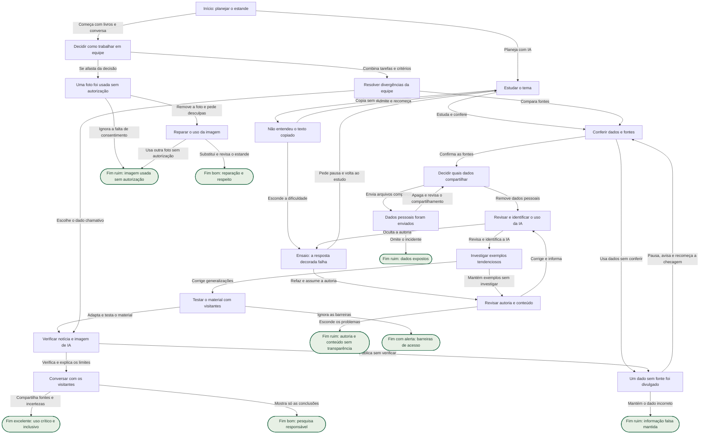

# Fluxograma da história

```mermaid
flowchart TD
  inicio[Início: planejar o estande]
  estudo[Estudar o tema]
  dependencia[Não entendeu o texto copiado]
  ensaio[Ensaio: a resposta decorada falha]
  pesquisa[Conferir dados e fontes]
  privacidade[Decidir quais dados compartilhar]
  exposicao[Dados pessoais foram enviados]
  autoria[Revisar e identificar o uso da IA]
  vies[Investigar exemplos tendenciosos]
  revisaoAutor[Revisar autoria e conteúdo]
  acessibilidade[Testar o material com visitantes]
  impacto[Verificar notícia e imagem de IA]
  apresentacao[Conversar com os visitantes]
  boato[Um dado sem fonte foi divulgado]
  semIA[Decidir como trabalhar em equipe]
  reuniao[Resolver divergências da equipe]
  equipe[Uma foto foi usada sem autorização]
  reparacaoImagem[Reparar o uso da imagem]

  finalPrivacidade([Fim ruim: dados expostos])
  finalAutoria([Fim ruim: autoria e conteúdo sem transparência])
  finalDesinformacao([Fim ruim: informação falsa mantida])
  finalConsentimento([Fim ruim: imagem usada sem autorização])
  finalBom([Fim bom: pesquisa responsável])
  finalBom2([Fim bom: reparação e respeito])
  finalExcelente([Fim excelente: uso crítico e inclusivo])
  finalLimitado([Fim com alerta: barreiras de acesso])

  inicio -->|Planeja com IA| estudo
  inicio -->|Começa com livros e conversa| semIA
  estudo -->|Estuda e confere| pesquisa
  estudo -->|Copia sem entender| dependencia
  dependencia -->|Admite e recomeça| estudo
  dependencia -->|Esconde a dificuldade| ensaio
  ensaio -->|Pede pausa e volta ao estudo| estudo
  ensaio -->|Refaz e assume a autoria| revisaoAutor
  pesquisa -->|Confirma as fontes| privacidade
  pesquisa -->|Usa dados sem conferir| boato
  privacidade -->|Remove dados pessoais| autoria
  privacidade -->|Envia arquivos completos| exposicao
  exposicao -->|Apaga e revisa o compartilhamento| privacidade
  exposicao -->|Omite o incidente| finalPrivacidade
  autoria -->|Revisa e identifica a IA| vies
  autoria -->|Oculta a autoria| ensaio
  vies -->|Corrige generalizações| acessibilidade
  vies -->|Mantém exemplos sem investigar| revisaoAutor
  revisaoAutor -->|Corrige e informa| autoria
  revisaoAutor -->|Esconde os problemas| finalAutoria
  acessibilidade -->|Adapta e testa o material| impacto
  acessibilidade -->|Ignora as barreiras| finalLimitado
  impacto -->|Verifica e explica os limites| apresentacao
  impacto -->|Publica sem verificar| boato
  apresentacao -->|Compartilha fontes e incertezas| finalExcelente
  apresentacao -->|Mostra só as conclusões| finalBom
  boato -->|Pausa, avisa e recomeça a checagem| pesquisa
  boato -->|Mantém o dado incorreto| finalDesinformacao
  semIA -->|Combina tarefas e critérios| reuniao
  semIA -->|Se afasta da decisão| equipe
  reuniao -->|Compara fontes| pesquisa
  reuniao -->|Escolhe o dado chamativo| impacto
  equipe -->|Remove a foto e pede desculpas| reparacaoImagem
  equipe -->|Ignora a falta de consentimento| finalConsentimento
  reparacaoImagem -->|Substitui e revisa o estande| finalBom2
  reparacaoImagem -->|Usa outra foto sem autorização| finalConsentimento

  classDef final fill:#e7f0e5,stroke:#246b4a,color:#203d2e,stroke-width:2px
  class finalPrivacidade,finalAutoria,finalDesinformacao,finalConsentimento,finalBom,finalBom2,finalExcelente,finalLimitado final
```